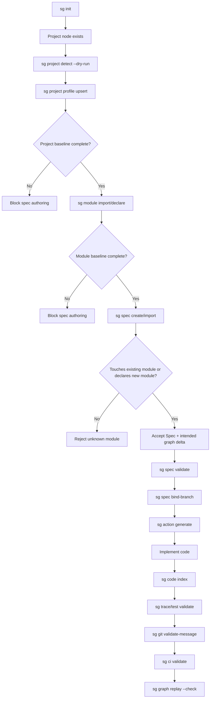

# SpecGraph OS Logical Workflow Analizi

> Reference analysis. Normative system-flow rules live in [`docs/workflows/system-flow.md`](system-flow.md), and implementation order is controlled by [`docs/full-system-implementation/phase-gated-implementation-plan.md`](../full-system-implementation/phase-gated-implementation-plan.md).

> Tarih: 2026-05-10  
> Dil: Türkçe  
> Amaç: Mevcut sistemdeki workflow mantığını incelemek, iş yapılırken doğru mantık sırasını tanımlamak ve SpecGraph OS için project-first / graph-first çalışma modelini detaylandırmak.  
> Not: Bu rapor implementation code değiştirmez; ürün, mimari ve enforcement tasarımı önerisidir.

---

## 1. Kısa sonuç

Mevcut SpecGraph OS foundation güçlü: event log, operation receipt, ontology, policy, validation, query, spec/action/git/code/test graph parçaları var. Ancak mevcut pratik akış hâlâ büyük ölçüde **spec-first** davranabiliyor:

```text
sg init
sg spec create/import
sg spec validate
sg spec bind-branch
sg action generate
sg code index
sg trace import/validate
sg git validate-message
sg ci validate
sg graph replay --check
```

Bu MVP/proof için yeterli; fakat full-system ürün mantığı için eksik. Doğru ürün sırası **project-first** olmalı:

```text
1. Project identity ve profile kurulur.
2. Module/architecture/data/security baseline kurulur.
3. Spec ancak bu bağlam üzerinde oluşturulur.
4. Spec mevcut module'a mı dokunuyor, yeni module mı yaratıyor, yeni object/function/interface mi planlıyor açıkça ayrılır.
5. ActionGraph ve CommitPlan bu graph context'ten üretilir.
6. Code/Test/CI/Git gerçekliği adapter observation olarak gelir.
7. Operation Runtime doğrular, policy uygular, receipt üretir ve canonical event append eder.
```

Ana öneri:

> `ProjectGraph` ve minimum `ModuleGraph` baseline tamamlanmadan `Spec.Create` ve `Spec.Import` kabul edilmemeli. Bu enforcement sadece CLI'da değil, Operation Runtime / trusted validation path içinde olmalı.

---

## 2. Mevcut sistemin okunan ana parçaları

Bu rapor şu repo parçalarına göre hazırlanmıştır:

- `README.md`
- `docs/architecture/boundaries.md`
- `docs/architecture/workspace-modules.md`
- `docs/full-system-foundation.md`
- `docs/full-system-implementation/phase-gated-implementation-plan.md`
- `docs/full-system-implementation/areas/15-projectgraph.md`
- `docs/full-system-implementation/areas/16-modulegraphs.md`
- `docs/full-system-implementation/areas/21-specgraph.md`
- `docs/full-system-implementation/areas/22-spec-authoring.md`
- `crates/sg-cli/src/main.rs`
- `crates/sg-operation/src/lib.rs`
- `crates/sg-store/src/store.rs`
- `crates/sg-project/src/lib.rs`
- `crates/sg-module-graph/src/lib.rs`
- `crates/sg-spec/src/lib.rs`
- `crates/sg-policy/src/lib.rs`
- `crates/sg-ontology/src/ontology.rs`
- `crates/sg-validation/src/*`

---

## 3. Sistemin temel prensibi

SpecGraph OS'te trusted state'in tek doğru yazma yolu şudur:

```text
Client / Adapter / Import / Proposal
        ↓
OperationRequest
        ↓
Operation Runtime
        ↓
Operation ABI validation
        ↓
Ontology validation
        ↓
Policy + approval + waiver + actor checks
        ↓
Validators / findings
        ↓
GraphDelta + OperationReceipt
        ↓
Canonical event append: .specgraph/events/*.jsonl
        ↓
Snapshots / indexes / reports rebuild edilir
```

Bunun anlamı:

- CLI, API, SDK, Studio doğrudan `.specgraph` truth yazamaz.
- Adapter'lar doğrudan trusted fact yaratamaz.
- LLM/agent output'u proposal veya observation olarak kalır.
- Gerçek kabul, Operation Runtime receipt'i ile olur.
- `events/*.jsonl` canonical history'dir.
- `snapshots`, `indexes`, reports rebuildable projection'dır.

Bu prensip doğru. Workflow tasarımındaki tüm öneriler bu prensibi korumalıdır.

---

## 4. Mevcut workflow analizi

### 4.1 `sg init`

Mevcut davranış:

```bash
sg init --project-name demo
```

Kurulan şey:

```text
.specgraph/
  config.yaml
  ontology.lock.json
  graph.lock.json
  ontology/packs/
  operations/receipts/
  events/00000001.jsonl
  snapshots/
  branches/
  indexes/
  validation/runs/
```

Graph açısından:

- `Project.Init` operasyonu çalışır.
- Temel `Project` node'u oluşur.

Sorun:

- `Project` node'u var diye project hazır sayılmamalı.
- Project type, language, package manager, test runner, CI provider, architecture style, module baseline eksik olabilir.
- Bu eksiklerle spec oluşturmak mümkün olmamalı.

Doğru yorum:

```text
sg init = storage/runtime başlangıcı
sg init ≠ spec yazmaya hazır project
```

### 4.2 `sg spec create/import`

Mevcut davranış:

```bash
sg spec create \
  --spec AUTH-001 \
  --title "Password reset" \
  --module Identity \
  --requirement "REQ-001:User can request reset" \
  --acceptance-criterion "AC-001:Endpoint returns generic response"
```

veya:

```bash
sg spec import specs/AUTH-001.yaml
```

Mevcut `SpecProjection` alanları zengin:

```text
spec
title
module
priority
summary
requirements
acceptanceCriteria
risks
mitigations
expectedBehaviors
forbiddenBehaviors
useCases
endpoints
entities
events
dataObjects
tests
```

Sorun:

- Project baseline complete mi kontrolü yok/eksik.
- Module baseline complete mi kontrolü yok/eksik.
- `module` alanı existing module touch mı, yoksa yeni module creation mı belirsiz.
- Spec içindeki planned object/function/interface ayrımı henüz açık değil.
- Spec import gerçek CodeGraph/TestGraph evidence gibi davranmamalı; sadece intention/plan üretmeli.

### 4.3 `sg spec validate`

Mevcut minimum kontrol:

- Her `Spec` en az bir `Requirement` içermeli.
- Her `Spec` en az bir `AcceptanceCriterion` içermeli.
- Ontology integrity çalışır.

Sorun:

- Bu kontrol geç geliyor. Spec zaten graph'a kabul edildikten sonra hataları bulmak, orphan/eksik semantic node'ları canonical history'ye sokabilir.
- Spec authoring gate, create/import öncesi veya dry-run acceptance sırasında çalışmalı.

### 4.4 `sg spec bind-branch`

Mevcut davranış:

- Spec bir Git branch'e bağlanır.
- `GitBranch` node'u oluşur.
- Base `GraphSnapshot` node'u oluşur.
- `Spec BOUND_TO_BRANCH GitBranch` edge'i oluşur.

Bu doğru bir akış. Ancak binding öncesi şunlar doğrulanmalı:

- Spec valid.
- Spec'in touched/new modules bilgisi valid.
- Project/module baseline valid.
- Action planning için yeterli context var.

### 4.5 `sg action generate`

Mevcut MVP template action groups:

```text
graph
tests
implementation
interface
validation
```

Sorun:

- ActionGraph daha doğru üretilebilmek için ProjectGraph/ModuleGraph/ArchitectureGraph context'ine ihtiyaç duyar.
- Örneğin spec `policy` module'a dokunuyorsa allowed file scope, required tests, approval policy, architecture constraints buna göre oluşmalı.

### 4.6 `sg code index`

Mevcut davranış:

- Changed files `CodeFile` facts olarak işlenir.
- Lightweight indexer `CodeSymbol` gözlemleri çıkarır.

Doğru trust ayrımı:

- Code indexer external reality gözlemler.
- Gözlem doğrudan spec intention değildir.
- Spec'te planned object varsa, code index sonrası gerçek `CodeSymbol` ile eşleştirilmelidir.

### 4.7 `sg trace import/validate`

Mevcut davranış:

- AcceptanceCriterion ↔ TestCase linkleri doğrulanır.

Genişletilmesi gereken mantık:

- Requirement ↔ Behavior
- Behavior ↔ CodeSymbol / Endpoint
- Risk ↔ Mitigation ↔ TestCase
- Module capability ↔ Spec
- PlannedObject ↔ CodeSymbol
- DataObject ↔ Migration/Test evidence

### 4.8 `sg git validate-message`

Mevcut trailer örneği:

```text
Spec: AUTH-001
ActionGroup: implementation
CommitPlan: implementation
```

Doğru mantık:

- Commit sadece bir spec'e bağlanmamalı.
- CommitPlan file scope, expected graph delta, required validation, action state ile de uyumlu olmalı.

### 4.9 `sg ci validate`

Mevcut aggregate validation iyi bir foundation. Hedefte CI şunları tekrar etmeli:

- graph replay/hash
- spec completeness
- project/module baseline
- action/commit plan compliance
- traceability
- policy/approval/waiver
- architecture/data/security drift
- test result evidence

---

## 5. Mevcut mimaride güçlü taraflar

### 5.1 Operation ABI var

`sg-operation` içinde çok sayıda operation contract var:

```text
Project.Init
Project.ProfileUpsert
ModuleGraph.Upsert
ArchitectureGraph.Upsert
DataGraph.Upsert
Migration.Record
Spec.Create
Spec.Import
Spec.Transition
Spec.BindBranch
ActionGraph.Generate
Action.Start / Complete / Replan
GitGraph.Record
GitCommit.Record
Policy.RecordApproval
Policy.CreateWaiver
Code.Index
Trace.Import
TestRun.Record
Validation.Record
Proposal.Create / Transition
OntologyPack.Install
```

Bu iyi haber: hedef workflow için gerekli operation isimleri ve boundary'ler büyük ölçüde düşünülmüş.

### 5.2 ProjectProfile foundation var

`sg-project` içinde şu baseline alanları zaten model seviyesinde var:

```text
project_type
architecture
languages
package_manager
test_runner
ci_provider
```

Eksik olan şey bu modeli CLI/validator/gate workflow'a bağlamak.

### 5.3 ModuleGraph foundation var

`sg-module-graph` şunları modelleyebiliyor:

```text
Module
Layer
Package
Capability
PublicInterface
```

Eksik olan şey:

- module lifecycle command,
- purpose/ownership gibi ürün alanları,
- spec authoring öncesi required gate.

### 5.4 Policy engine foundation var

`sg-policy` içinde:

- `Allow`
- `Warn`
- `Deny`
- `RequireApproval`

mantığı var. Built-in policy örnekleri:

- secret-like file path deny,
- migration dosyası approval ister,
- non-waivable policy listesi.

Bu mekanizma project/module gate'leriyle birleştirilebilir.

---

## 6. Ana gap listesi

| Gap | Etki | Önerilen çözüm |
|---|---|---|
| Spec authoring project baseline olmadan başlayabiliyor | Yanlış context, orphan spec, policy bypass | `Spec.Create/Import` için `project_baseline_complete` precondition |
| Module baseline required değil | Spec'in nereye dokunduğu belirsiz | `module_baseline_complete` gate |
| `module` alanı overloaded | Existing touch mı, new module mı belirsiz | `touchesModules` ve `moduleChanges` ayrımı |
| Spec gerçek code object gibi davranabilir | Planned vs observed karışır | `PlannedObject` / `IntendedGraphDelta` modeli |
| Semantic validation append sonrası geç kalabilir | Invalid state event log'a girebilir | Operation-specific pre-apply validator |
| Dedicated `sg project` / `sg module` CLI yok | Kullanıcı/agent setup yapamaz | Project/module command groups eklenmeli |
| Optional vs required bilgi ayrımı net değil | Agent soru akışı dağılır | Required / conditional / optional schema |
| Agent workflow tanımsız | Gereksiz soru veya eksik setup | Detect -> ask required -> suggest optional -> dry-run -> accept |

---

## 7. Hedef workflow: mantık sırası

### Faz 0 — Repository/runtime başlangıcı

```bash
sg init --project-name SpecGraph
```

Amaç:

- `.specgraph` layout kurulur.
- `Project` node'u oluşur.
- Event chain başlar.

State:

```text
Project exists: yes
Project profile complete: no
Module baseline complete: no
Spec authoring allowed: no
```

### Faz 1 — Project detection

Önerilen komut:

```bash
sg project detect --dry-run
```

Repo'dan çıkarılabilecek gözlemler:

```text
Cargo.toml -> Rust workspace, cargo
package.json -> Node/TypeScript package info
.github/workflows/* -> GitHub Actions
crates/* -> Rust crate/module candidates
packages/* -> TS/UI package candidates
docs/architecture/* -> architecture hints
```

Trust durumu:

```text
Detection output = untrusted observation
Accepted profile = Operation Runtime'dan geçmiş trusted fact
```

### Faz 2 — Project profile bootstrap

Önerilen komutlar:

```bash
sg project bootstrap --interactive
sg project profile upsert --file project-profile.yaml
sg project validate --gate spec-authoring
```

Minimum profile:

```yaml
project:
  name: SpecGraph
  summary: Graph-constrained software execution runtime
  type: developer-tooling
  primaryLanguage: rust
  languages:
    - rust
    - typescript
  architectureStyle: modular-workspace
  packageManager: cargo
  testRunner: cargo-test
  ciProvider: github-actions
```

Accepted facts:

```text
Project HAS_PROJECT_TYPE ProjectType
Project USES_LANGUAGE Language
Project HAS_ARCHITECTURE_STYLE ArchitectureStyle
Project USES_PACKAGE_MANAGER PackageManager
Project USES_TEST_RUNNER TestRunner
Project USES_CI_PROVIDER CIProvider
```

### Faz 3 — Module baseline

Önerilen komutlar:

```bash
sg module detect --dry-run
sg module import modules.yaml
sg module validate --gate spec-authoring
sg module list
```

Minimum module:

```yaml
modules:
  - name: policy
    purpose: Policy evaluation, approvals, waivers, non-waivable rules
    layer: trusted-runtime
    package: crates/sg-policy
    capabilities:
      - policy-evaluation
      - approval-checking
      - waiver-validation
    interfaces:
      - name: evaluate_policies
        visibility: public
        surface: rust-fn
```

Required fields:

| Field | Required | Açıklama |
|---|---:|---|
| `name` | Evet | Stable identity |
| `purpose` | Evet | Agent/spec anlamlandırması |
| `layer` | Evet | Architecture boundary |
| `package` veya `path` | Evet | File scope / ownership |
| `capabilities` | Evet | Spec capability mapping |
| `interfaces` | Koşullu | Public API varsa required |
| `owner` | Opsiyonel/strict | Approval authority için |
| `riskLevel` | Opsiyonel/conditional | Security/data-sensitive modules için |

### Faz 4 — Architecture/Data/Security baseline

Bu her project'te baştan full required olmayabilir; ama conditional gate'ler için temel tanım gerekir.

Örnek:

```yaml
architecture:
  style: modular-workspace
  layers:
    - trusted-foundation
    - trusted-runtime
    - domain-runtime
    - adapter
    - outer-surface
  forbiddenDependencies:
    - from: trusted-runtime
      to: adapter

security:
  secretFiles: deny
  productionAccess: denied-by-default

data:
  database: none
  migrationsRequired: false
```

Mantık:

- Architecture-sensitive spec -> architecture baseline required.
- Data/migration spec -> DataGraph + migration policy required.
- Security-sensitive spec -> security risk/mitigation/policy/test required.

### Faz 5 — Spec authoring

Yeni hedef spec schema mantığı:

```yaml
spec: BILLING-001
title: Add billing module
summary: Add initial billing capability.

touchesModules:
  - existing-module

moduleChanges:
  - action: create
    name: billing
    purpose: Billing and payment orchestration
    layer: domain-runtime
    package: crates/sg-billing
    capabilities:
      - billing-session
    interfaces:
      - name: BillingService
        visibility: public
        surface: rust-trait

plannedObjects:
  - kind: function
    name: create_billing_session
    module: billing
    expectedFile: crates/sg-billing/src/lib.rs

requirements:
  - id: REQ-001
    text: System can create billing sessions.

acceptanceCriteria:
  - id: AC-001
    text: Billing session creation is tested.
```

Spec acceptance preconditions:

```text
Project baseline complete
Module baseline complete
Touched modules exist OR new modules are fully declared
Planned objects have owning module
Conditional required fields satisfied
Spec has at least one requirement
Spec has at least one acceptance criterion
```

### Faz 6 — Spec validation

`sg spec validate` hedefte sadece minimum completeness değil, şu alanları da kontrol etmeli:

```text
Spec -> Requirement
Spec -> AcceptanceCriterion
Spec -> Module/Capability
Spec -> Risk/Mitigation
Spec -> Endpoint/PublicInterface
Spec -> DataObject/DataContract
Spec -> PlannedObject
Spec -> TestCase expectation
```

### Faz 7 — Branch binding

```bash
sg spec bind-branch --spec BILLING-001 --branch spec/BILLING-001-billing-module
```

Preconditions:

```text
Spec valid
Project/module gates passed
No unresolved blocking findings
Branch name follows policy
Base graph snapshot recorded
```

### Faz 8 — ActionGraph generation

```bash
sg action generate --spec BILLING-001
```

ActionGraph artık generic template yerine graph context'e göre zenginleşmeli:

```text
graph-update actions
module/interface actions
implementation actions
test actions
data/migration actions if needed
security/risk validation actions if needed
architecture validation actions if needed
ci/release evidence actions
```

### Faz 9 — Implementation + CodeGraph

Kod yazıldıktan sonra:

```bash
sg code index --changed-file crates/sg-billing/src/lib.rs
```

CodeGraph mantığı:

```text
Spec planned object: create_billing_session
Observed CodeSymbol: create_billing_session
Validation edge: planned object REALIZED_BY CodeSymbol
```

Spec gerçek symbol üretmez; code indexer gerçekliği gözlemler.

### Faz 10 — TestGraph + traceability

```bash
sg trace import --links-file links.yaml
sg trace validate --links-file links.yaml
sg test run --record
```

Hedef links:

```text
AcceptanceCriterion -> TestCase
Risk -> TestCase
Behavior -> TestCase
PolicyRequirement -> TestCase
PlannedObject -> CodeSymbol
Endpoint -> Route/Handler
DataObject -> Migration/TestEvidence
```

### Faz 11 — Git/CommitPlan

Commit message:

```text
Spec: BILLING-001
ActionGroup: implementation
CommitPlan: implementation
```

Hedef enforcement:

```text
Commit touches only allowed files
Commit belongs to active spec branch
Commit satisfies current ActionGroup
Required tests/validation have evidence
Policy approvals/waivers valid
```

### Faz 12 — CI validation

```bash
sg ci validate --record
```

CI şu kontrolleri birleştirmeli:

```text
replay/hash
project baseline
module baseline
spec validity
action state
commit plan
code scope
traceability
test evidence
policy/approval/waiver
architecture/data/security drift
```

### Faz 13 — Merge/rebase/impact

Merge öncesi:

```bash
sg graph diff
sg graph conflicts
sg impact analyze --node node_spec_billing_001
```

Hedef:

```text
Semantic conflict varsa merge block
Impact varsa revalidation queue oluşur
Policy etkilenirse ActionGraph replan ister
Ontology/data/security değişirse approval gerekir
```

---

## 8. Required / conditional / optional bilgi modeli

### 8.1 Zorunlu baseline

Spec authoring başlamadan önce required:

| Bilgi | Graph karşılığı | Eksikse |
|---|---|---|
| Project exists | `Project` | `sg init` çalıştır |
| Project type | `HAS_PROJECT_TYPE` | block |
| Language | `USES_LANGUAGE` | block |
| Architecture style | `HAS_ARCHITECTURE_STYLE` | block |
| Package manager | `USES_PACKAGE_MANAGER` | block |
| Test runner | `USES_TEST_RUNNER` | block |
| CI provider | `USES_CI_PROVIDER` | block |
| En az bir module | `HAS_MODULE` | block |
| Module purpose | Module attribute | block |
| Module layer | `IN_LAYER` / attr | block |
| Module package/path | `PACKAGE_IN_MODULE` / attr | block |
| Module capability | `HAS_CAPABILITY` | block |

### 8.2 Koşullu zorunlu bilgiler

| Durum | Zorunlu hale gelen bilgi |
|---|---|
| Yeni module | full `moduleChanges` declaration |
| Public API | Endpoint/PublicInterface + tests |
| Data migration | Data owner + rollback + migration tests + approval |
| Security-sensitive change | risk + mitigation + policy + security tests |
| Cross-module call | architecture boundary validation |
| LLM proposal accept | proposal trust state + sandbox/evidence |
| Production/deployment | release/approval policy |
| CI/test tooling change | CI provider/test runner profile update |

### 8.3 Opsiyonel bilgiler

Opsiyonel ama faydalı:

```yaml
product:
  users:
    - developers
    - platform engineers
  goals:
    - deterministic execution
    - traceability
  nonGoals:
    - direct .specgraph mutation

ownership:
  teams:
    - platform
    - security
  codeOwners:
    crates/sg-policy: platform-security

quality:
  performanceBudgets:
    replay: required
    query: required
    indexing: required

observability:
  reports:
    - validation
    - ci
    - drift
```

Opsiyonel eksikse:

- default mode: warning/suggestion
- strict mode: bazıları required yapılabilir

---

## 9. Agent/wizard davranışı

Agent mantığı şu olmalı:

```text
1. Mevcut graph state'i oku.
2. Repo'dan detection yap.
3. Required eksikleri çıkar.
4. Conditional required alanları spec intent'e göre çıkar.
5. Optional önerileri ayrı göster.
6. Önce required bilgileri sor.
7. Optional bilgileri toplu öner.
8. Dry-run receipt üret.
9. Kullanıcı onaylarsa operation append.
```

Agent yanlış davranış:

```text
Spec'i hemen yazmak
Eksik project/module bilgilerini varsaymak
Gerçek CodeSymbol/TestResult varmış gibi graph'a yazmak
Optional sorularla kullanıcıyı boğmak
```

Agent doğru davranış örneği:

```text
Detected:
- language: rust
- packageManager: cargo
- testRunner: cargo-test
- ciProvider: github-actions

Need confirmation:
- projectType: developer-tooling mı?
- architectureStyle: modular-workspace mı?

Required missing:
- initial modules and purposes

Optional suggestions:
- define security boundary policy
- define replay/query performance budgets
```

---

## 10. Enforcement noktaları

### 10.1 Sadece CLI yeterli değil

Yanlış:

```text
sg-cli checks project baseline, then append_operation
```

Neden yanlış?

- API server CLI'ı bypass edebilir.
- SDK direct operation gönderebilir.
- Studio UI operation form kullanabilir.
- Adapter/proposal acceptance flow farklı surface olabilir.

### 10.2 Doğru yer

Doğru enforcement yeri:

```text
Operation Runtime / trusted validation layer
```

Özellikle:

```text
Spec.Create
Spec.Import
Spec.Transition
Spec.BindBranch
ActionGraph.Generate
GitCommit.Record
Validation.Record
```

her biri operation-specific semantic precondition çalıştırmalı.

### 10.3 Append operation hedef akışı

Mevcut akışa önerilen eklemeler:

```text
1. replay current graph
2. build OperationRequest
3. validate Operation ABI
4. validate generic preconditions
5. validate operation-specific semantic preconditions   <-- eklenmeli
6. evaluate policy/actor/approval/waiver
7. validate ontology state transitions
8. apply delta to candidate graph
9. validate postconditions
10. validate candidate graph semantic completeness      <-- genişletilmeli
11. compute hash + receipt
12. dry-run or append event
```

---

## 11. Önerilen validator'lar

```text
validator.project_baseline
validator.module_baseline
validator.spec_authoring_preconditions
validator.spec_module_consistency
validator.spec_intended_delta
validator.planned_object_ownership
validator.conditional_requirements
validator.action_context
validator.commit_plan_scope
validator.traceability_completeness
```

Örnek finding:

```json
{
  "code": "project.baseline_incomplete",
  "severity": "Error",
  "validator": "validator.project_baseline",
  "message": "Spec authoring requires a complete ProjectGraph baseline.",
  "remediation": "Run `sg project bootstrap --interactive` or `sg project profile upsert --file project-profile.yaml`."
}
```

---

## 12. Failure path örnekleri

### 12.1 Project baseline eksik

```bash
sg spec create --spec AUTH-001 --title "Password reset"
```

Hedef:

```text
failed: project.baseline_incomplete
missing:
  - HAS_PROJECT_TYPE
  - USES_LANGUAGE
  - HAS_ARCHITECTURE_STYLE
  - USES_PACKAGE_MANAGER
  - USES_TEST_RUNNER
  - USES_CI_PROVIDER
```

### 12.2 Module baseline eksik

```text
failed: module.baseline_missing
message: Spec authoring requires at least one valid Module.
remediation: Run `sg module import modules.yaml`.
```

### 12.3 Unknown module

Spec:

```yaml
spec: AUTH-001
title: Password reset
module: Identity
```

Hedef:

```text
failed: spec.unknown_module
message: Spec touches module `Identity`, but that module does not exist and the spec does not declare it as a new module.
```

### 12.4 Incomplete new module declaration

```yaml
moduleChanges:
  - action: create
    name: billing
```

Hedef:

```text
failed: module.declaration_incomplete
missing:
  - purpose
  - layer
  - package
  - capabilities
```

---

## 13. Happy path örneği

```bash
sg init --project-name SpecGraph

sg project detect --dry-run
sg project profile upsert --file project-profile.yaml
sg project validate --gate spec-authoring

sg module import modules.yaml
sg module validate --gate spec-authoring

sg spec import specs/BILLING-001.yaml --dry-run
sg spec import specs/BILLING-001.yaml
sg spec validate

sg spec bind-branch --spec BILLING-001 --branch spec/BILLING-001-billing-module
sg action generate --spec BILLING-001

sg code index --changed-file crates/sg-billing/src/lib.rs
sg trace import --links-file links.yaml
sg trace validate --links-file links.yaml

sg git validate-message --message-file .git/COMMIT_EDITMSG --changed-file crates/sg-billing/src/lib.rs
sg ci validate --record
sg graph replay --check
```

---

## 14. Mermaid diagram



---

## 15. Implementation slice önerisi

Bu rapordan sonra mantıklı implementation sırası:

### Slice 1 — Project baseline validator

- `validator.project_baseline` ekle.
- Required project facts eksikse finding üret.
- `Spec.Create` / `Spec.Import` için blocking precondition yap.

### Slice 2 — Project CLI

- `sg project profile upsert --file`
- `sg project validate --gate spec-authoring`
- `sg project show`

### Slice 3 — Module baseline validator

- En az bir module required.
- Module fields: name, purpose, layer, package/path, capabilities.
- PublicInterface owner/visibility kontrollerini genişlet.

### Slice 4 — Module CLI

- `sg module import modules.yaml`
- `sg module declare`
- `sg module validate --gate spec-authoring`
- `sg module list`

### Slice 5 — Spec projection ayrımı

- `touchesModules`
- `moduleChanges`
- `plannedObjects`
- `intendedGraphDelta`

### Slice 6 — Operation-specific semantic gates

- `Spec.Create`
- `Spec.Import`
- `Spec.BindBranch`
- `ActionGraph.Generate`

### Slice 7 — Agent/wizard workflow

- `sg project detect --dry-run`
- `sg project bootstrap --interactive`
- Required/optional question planner.

---

## 16. Net karar önerileri

1. `sg init` sadece storage/runtime init olarak kalmalı; spec authoring readiness sağlamamalı.
2. Project profile complete olmadan spec create/import block edilmeli.
3. En az bir valid module olmadan spec create/import block edilmeli.
4. Spec'in `module` alanı yerine daha açık `touchesModules` ve `moduleChanges` modeli gelmeli.
5. Spec'te function/object/interface tanımı gerçek implementation değil, planned intent olarak modellenmeli.
6. CodeGraph gerçekliği yalnızca code indexer sonrası gözlem/acceptance ile gelmeli.
7. TestGraph evidence gerçek test run veya link import sonrası gelmeli.
8. Conditional required alanlar spec içeriğine göre devreye girmeli.
9. Enforcement CLI'da değil Operation Runtime/trusted validation path'te olmalı.
10. Agent önce detect etmeli, sonra sadece required eksikleri sormalı, optional bilgileri öneri olarak sunmalı.

---

## 17. Sonuç

SpecGraph OS'in hedefi sadece spec dosyalarını düzenlemek değil; yazılım geliştirme sürecini trusted graph üzerinde yönetmek. Bu yüzden mantıklı workflow:

```text
Project context olmadan Spec yok.
Module context olmadan Action yok.
Planned object olmadan implementation scope yok.
Observed code/test evidence olmadan validation yok.
Receipt olmadan trusted mutation yok.
```

Bu sırayı enforce etmek, sistemin ana değerini güçlendirir:

- daha az orphan graph fact,
- daha doğru ActionGraph,
- daha güçlü policy enforcement,
- daha iyi agent soru akışı,
- daha deterministik CI/validation,
- daha güvenilir project evolution.
